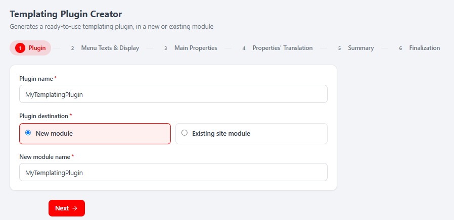
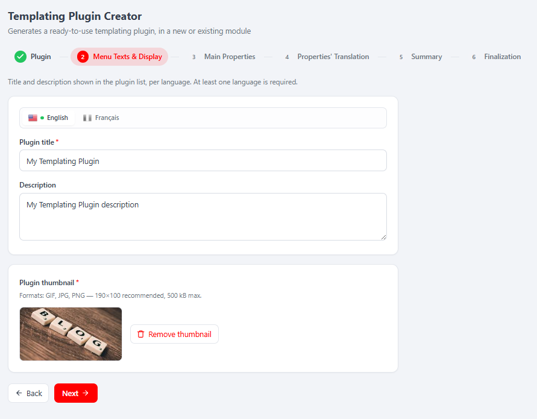
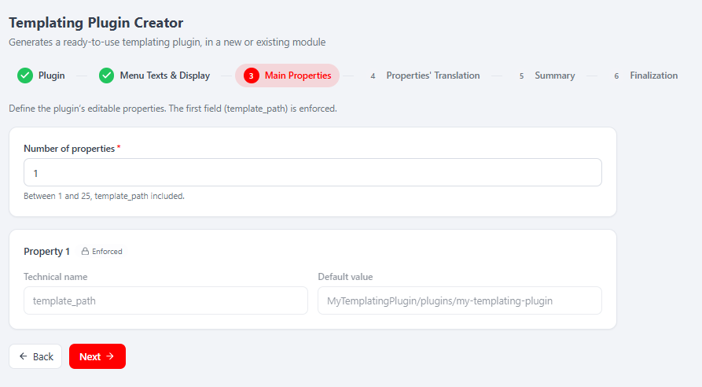
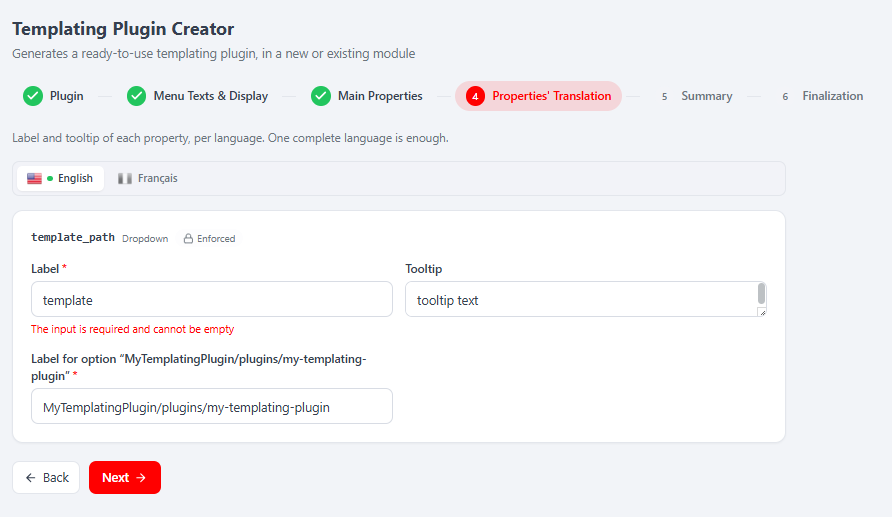
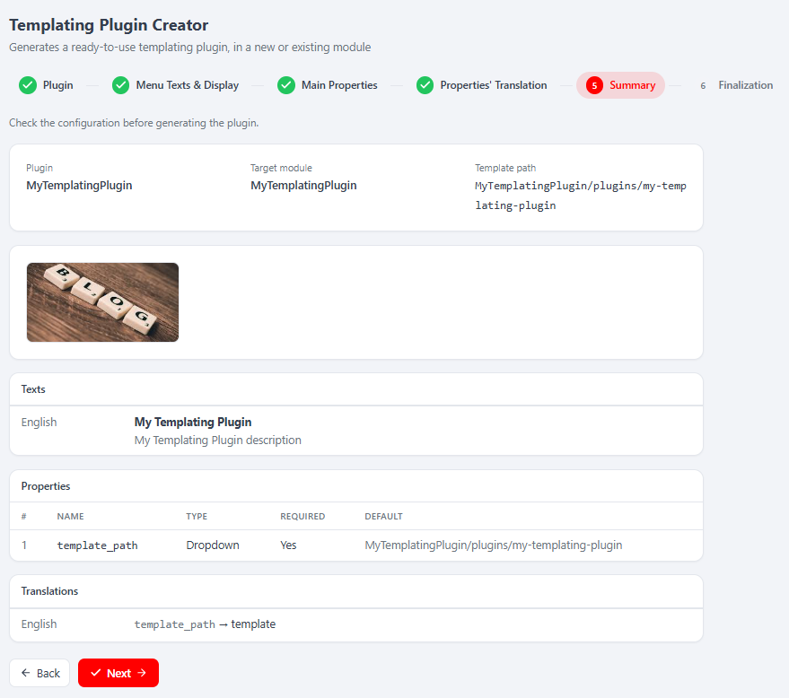
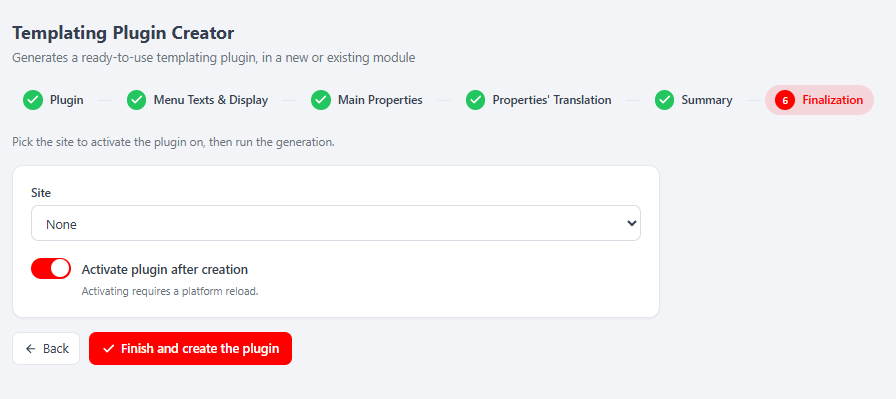

# MelisTemplatingPluginCreator (React back-office) — Functional & Technical Documentation (for AI)

> **What this is.** MelisTemplatingPluginCreator is a **code-generation assistant**: a **6-step
> wizard** that scaffolds a ready-to-use **templating plugin** — a front-end CMS plugin (a block you
> drop onto pages in the page editor) — into either a **brand-new module** or an **existing site
> module**. This document covers it **in the new React back-office** (`/melis-react`): the module
> ships a **native full-React brick** — a real React wizard calling a `react-api` JSON layer — with a
> **New / Old toggle** that can fall back to the legacy jQuery tool in an iframe. **All the real work
> stays server-side**: validation reuses the legacy Laminas forms, and the generation calls
> `MelisTemplatingPluginCreatorService` (which writes PHP files to disk, rewrites
> `module.config.php` / `Module.php` / language files, and activates the module). React is
> presentation + API calls. There is **no legacy MelisAI doc** for this module, so nothing is
> cross-linked below.
>
> **How this document is organised — two clearly separated parts:**
> - **[Part A — Functional Guide](#part-a--functional-guide)** — for everyday users (and the chat
>   assistant) using the React back-office. Plain language.
> - **[Part B — Technical Reference](#part-b--technical-reference)** — for developers and AI
>   building inside the React UI, with code (brick manifest, endpoints, capabilities).
>
> **Audience**: consumed by the **MelisAI** MCP. **Status**: reviewed 2026-08-19.

---

## 0. Where this lives in the React back-office — read this first

- **Brick kind: native full-React** (not an iframe brick). The wizard is authored in React
  (`ui-react/src/`) and reads/writes through `/melis/react-api/tpc/*` endpoints defined in the
  module. It also keeps a **New / Old toggle**: *Old* renders the legacy tool in an iframe
  (`/melis/react-tool-page?key=melistemplatingplugincreator_tool`), *New* is the React wizard
  (default).
- **Where in the menu.** The tool surfaces under the route derived from its `forwardKey`
  `MelisTemplatingPluginCreator/TemplatingPluginCreator`; the manifest `route`
  `/melis-core/templating-plugin-creator` is the fallback mount. The tool appears **only if the
  module is activated** (modular brick discovery, see §B5).
- **The brick is `persistent`** and **has no sub-tabs** (`subTabs: false`): the wizard is one mounted
  page whose 6 steps are CSS-shown/hidden panes — leaving the tool and coming back loses **neither
  the draft nor the current step**.
- **What "generate" actually does (be honest).** Step 6 is the **only mutating operation**. It writes
  the templating-plugin PHP/view/config/language files onto disk via
  `MelisTemplatingPluginCreatorService::generateTemplatingPlugin()`, and — for the *new module*
  branch — first scaffolds an empty module via `MelisToolCreatorService::createTool()`, optionally
  registers the new module in the chosen **site**'s `module.load.php`, **activates the module**, and
  invalidates the module-paths cache (`config/melis.modules.path.php`). Activating requires a
  **platform reload** (the wizard counts down and reloads). This is the sensitive capability
  (`finalization.create`). *(The exact files written and config rewrites are inside the legacy
  service — I read the controller's calls/comments, not the service internals.)*
- **No coupled `-react.md` sibling to cross-link and no legacy doc.**

---
---

# PART A — Functional Guide

## A1. What you can do with the Templating Plugin Creator in the new back-office

- **Scaffold a templating plugin** — a front-end CMS block you drag onto pages in the page editor —
  without writing PHP by hand.
- **Target a new or an existing module** — create a fresh module for the plugin, or add the plugin
  into a **site module** you already have.
- **Localise it** — enter the plugin's menu title/description **per language** (as shown in the page
  editor's plugin list).
- **Design its editable properties** — declare the plugin's configuration **fields** (name, display
  type — text, dropdown, date, numeric, switch, rich text… — required flag and default value). The
  first property is always the enforced `template_path`.
- **Translate the properties** — a label and tooltip per field, per language (plus a label per
  dropdown option).
- **Review, then generate** — a read-only summary, then a one-click **Finish and create the plugin**
  (optionally activate it on a chosen site immediately).
- **Compare New vs Old** — switch the whole tool between the React wizard and the classic tool with
  the **New / Old** toggle.

## A2. Finding it in /melis-react

**Where:** open the tool from its left-menu entry (route
`/melis-core/templating-plugin-creator`). It opens as a top tab named **Templating Plugin Creator**,
with a 6-step bar across the top and the **New / Old** toggle (top-right, next to **Restart**).


*Step 1 (**Plugin**) of the React wizard: title "Templating Plugin Creator", subtitle "Generates a ready-to-use templating plugin, in a new or existing module", the 6-step bar (1 Plugin · 2 Menu Texts & Display · 3 Main Properties · 4 Properties' Translation · 5 Summary · 6 Finalization), and the form — **Plugin name** ("MyTemplatingPlugin"), **Plugin destination** (New module / Existing site module) with a **New module name** field — and the **Next** button.*

## A3. Key words explained

- **Templating plugin** — a front-end CMS plugin/block generated by this tool, droppable onto pages
  in the page editor; it renders a view driven by its configured properties.
- **New module / Existing site module** — where the generated plugin lives: a fresh module scaffolded
  for it, or a **site module** already on the platform.
- **Property (field)** — one editable configuration input of the plugin (name + display type +
  required + default value). The first property is always the enforced **`template_path`**.
- **`template_path`** — the enforced first property, computed server-side as
  `<Module>/plugins/<plugin-view-name>`; shown read-only, never posted by the client.
- **Thumbnail** — the required preview image of the plugin (GIF/JPG/PNG, ~190×100, ≤500 kB).
- **Property translation** — a label + tooltip for each property, per language (plus a label per
  dropdown option).
- **New / Old** — the two views of the same tool: **New** = React wizard, **Old** = the classic tool
  in an iframe.
- **Restart** — clears the wizard (session draft + temporary thumbnail) and returns to step 1.

## A4. Step 1 — Plugin (name + destination)

You enter the **Plugin name** (e.g. `MyTemplatingPlugin`) and choose the **Plugin destination**:
**New module** (reveals a **New module name** field) or **Existing site module** (reveals a **module**
dropdown; disabled if you have no user/site modules). Clicking **Next** validates this step
server-side (reserved PHP keyword, module already exists, plugin name already taken in the chosen
existing module) and advances. On success the server computes the enforced `template_path` used in
step 3.

## A5. Step 2 — Menu Texts & Display (localised title/description + thumbnail)

Enter, **per language** (a language tab bar with a green dot marking completed languages), the
**Plugin title** and an optional **Description** shown in the page editor's plugin list. **At least
one language is required.** Below, upload the **Plugin thumbnail** (required; GIF/JPG/PNG, ~190×100,
≤500 kB) — with a preview and **Remove thumbnail**.


*Step 2 (**Menu Texts & Display**), "Title and description shown in the plugin list, per language. At least one language is required.": the language tab bar (English / Français), **Plugin title** ("My Templating Plugin") and **Description** ("My Templating Plugin description") for the active language, then the **Plugin thumbnail** card (formats hint, image preview, **Remove thumbnail**). Back / Next at the bottom.*

## A6. Step 3 — Main Properties (the plugin's editable fields)

Set the **Number of properties** (between 1 and 25, `template_path` included). **Property 1** is always
the enforced, read-only **`template_path`** (name + computed default value). Properties 2..N are
free: for each you enter a **Technical name**, a **Display type** (text, Dropdown, DatePicker,
DateTimePicker, NumericInput, PageInput, Switch, Textarea, rich text…), a **Required** flag and a
**Default value** (the input widget adapts to the display type; Dropdown adds a comma-separated
**Options** field).


*Step 3 (**Main Properties**), "Define the plugin's editable properties. The first field (template_path) is enforced.": **Number of properties** ("Between 1 and 25, template_path included") and **Property 1** — the **Enforced** `template_path` with its computed default value `MyTemplatingPlugin/plugins/my-templating-plugin`. Back / Next.*

## A7. Step 4 — Properties' Translation (label + tooltip per language)

For each property, enter a **Label** and an optional **Tooltip**, **per language** (a language tab bar,
green dot when a language is complete). Dropdown properties additionally require a **Label** per
option. **One complete language is enough.** The list of fields to translate — and the exact option
label keys — is derived from step 3 server-side.


*Step 4 (**Properties' Translation**), "Label and tooltip of each property, per language. One complete language is enough.": the `template_path` (Dropdown, Enforced) property with **Label** ("template"), **Tooltip**, and a **Label for option "…"** field. Back / Next.*

## A8. Step 5 — Summary (read-only review)

A read-only recap of everything configured: **Plugin** name, **Target module**, the computed
**Template path**, the **thumbnail**, the **Texts** (per language), the **Properties** table (#, name,
type, required, default) and the **Translations** (per language). Nothing is written here; **Next**
just advances.


*Step 5 (**Summary**), "Check the configuration before generating the plugin.": Plugin `MyTemplatingPlugin`, Target module `MyTemplatingPlugin`, Template path `MyTemplatingPlugin/plugins/my-templating-plugin`; the thumbnail; **Texts** (English — "My Templating Plugin" / description); the **Properties** table (1 · template_path · Dropdown · Yes · default); **Translations** (English — template_path → template). Back / Next.*

## A9. Step 6 — Finalization (generate the plugin)

The final step runs the generation. For a **new module** you can pick a **Site** to activate the
plugin on (or **None**). A toggle **Activate plugin after creation** (on by default; "Activating
requires a platform reload") controls whether the generated module is turned on immediately. Clicking
**Finish and create the plugin** writes the plugin to disk; on success you see a confirmation (module
+ plugin names, any non-blocking notices) and, if activation was requested, a countdown that reloads
the platform, plus **Create another** to restart the wizard.


*Step 6 (**Finalization**), "Pick the site to activate the plugin on, then run the generation.": the **Site** dropdown (None), the **Activate plugin after creation** toggle (on) with the note "Activating requires a platform reload.", and the **Finish and create the plugin** button. Back at the bottom.*

## A10. Common tasks — "How do I…?"

- **Create a templating plugin in a new module** → Step 1: name it, pick **New module** + a module
  name → Step 2: titles + thumbnail → Step 3: number of properties + each field → Step 4: labels →
  Step 5: review → Step 6: pick a site (optional), **Finish and create the plugin** (leave activation
  on).
- **Add a plugin into an existing site module** → Step 1: pick **Existing site module** + choose the
  module.
- **Add configuration inputs to the plugin** → Step 3: raise **Number of properties**, then fill each
  property's name/type/required/default (Dropdown needs its Options).
- **Start over** → **Restart** (top toolbar) — clears the draft and returns to step 1.
- **Compare with the classic tool** → top-right **New / Old** toggle → **Old** (⚠ opening the legacy
  view resets the wizard draft).

> **Tip:** the wizard is `persistent` — you can leave the tool tab and come back without losing your
> place or your inputs. Switching to **Old** is the one exception (it resets the shared session
> draft); the wizard warns before switching if you have a draft.

---
---

# PART B — Technical Reference

## B1. React presence at a glance

| Item | Value |
|---|---|
| Brick kind | **Native full-React** (6-step wizard, with a New/Old legacy-iframe fallback) |
| Brick id | `templating-plugin-creator` (matches `brick.tsx` ⇄ `brick.manifest.json`) |
| Manifest `route` | `/melis-core/templating-plugin-creator` (fallback; real mount is the menu-tree route via `forwardKey`) |
| `label` | `Templating Plugin Creator` |
| `forwardKey` | `MelisTemplatingPluginCreator/TemplatingPluginCreator` |
| `melisKey` (manifest / Old-view iframe / rights) | `melistemplatingplugincreator_tool` |
| `entry` | `brick.js` |
| `subTabs` | `false` |
| `persistent` | `true` (wizard kept mounted; steps are CSS panes) |
| Access-guard / capabilities melisKey | `melistemplatingplugincreator_tool` (rights-bearing node — same as manifest) |
| API base | `/melis/react-api/tpc` |
| Generation service | `MelisTemplatingPluginCreatorService` (+ `MelisToolCreatorService` for the new-module branch) |
| Activation-gated | Yes (appears iff the module is active / in `config/melis.module.load.php`) |
| Legacy MelisAI doc | none |

## B2. The brick — anatomy

Source in `ui-react/` (Vite **IIFE**, React externalised to the host globals `MelisReact*`, output
to `public/ui-react/brick.js` next to `brick.manifest.json`).

`ui-react/src/brick.tsx` registers ONE routed component under the brick id:
```tsx
import TpcPage from './TpcPage'
window.__melisRegisterBrick?.({ id: 'templating-plugin-creator', Component: TpcPage })  // id MUST match the manifest
```

Manifest (`public/ui-react/brick.manifest.json`):
```json
{ "id": "templating-plugin-creator", "route": "/melis-core/templating-plugin-creator",
  "label": "Templating Plugin Creator",
  "forwardKey": "MelisTemplatingPluginCreator/TemplatingPluginCreator",
  "melisKey": "melistemplatingplugincreator_tool",
  "subTabs": false, "persistent": true, "entry": "brick.js" }
```

React components (`ui-react/src/`):

| File | Role |
|---|---|
| `TpcPage.tsx` | **Wizard container**. Fetches `context` + `state` once on mount, holds the single source of truth (step1/step2/fields/step4/thumbnail/templatePath, per-step errors), drives the **step bar** and Back/Next, gates each control via `useCaps`, and owns the **New/Old** `mode`. The 6 steps are mounted once and shown/hidden via `<Pane>` (no remount, no refetch). Has a **Restart** button (calls `/tpc/reset`). If `context.blocking` is non-empty (FS not writable / GD missing) it shows only the blocking notice. |
| `Step1Plugin.tsx` | **Step 1 — Plugin**: plugin name + destination (new module → new-module name; existing site module → module select, disabled if none). Business rules validated **server-side**; the component only renders returned messages. |
| `Step2Texts.tsx` | **Step 2 — Menu Texts & Display**: per-language title/description (`LangTabs`), plus the required **thumbnail** upload/remove (its own caps `thumbnail.create` / `thumbnail.delete`). Uploads immediately via `/tpc/thumbnail`. |
| `Step3Fields.tsx` | **Step 3 — Main Properties**: number of properties (1..`ctx.maxFields`=25) + one card per field. Field 1 is the locked `template_path` (name + server-computed default). Fields 2..N: technical name, display type, required, default value (widget adapts to type; Dropdown gets an Options field). Exports `resizeFields()`. |
| `Step4Translations.tsx` | **Step 4 — Properties' Translation**: per-language label/tooltip for each field (from `/tpc/translation-fields`), plus a label per Dropdown option (`LangTabs`, green dot on complete languages). |
| `Step5Summary.tsx` | **Step 5 — Summary**: read-only recap fetched from `/tpc/summary` on entering the step (`active`) — plugin/target module/template path, thumbnail, texts, properties table, translations. |
| `Step6Finalize.tsx` | **Step 6 — Finalization**: site select (new-module branch) + **Activate** toggle + **Finish and create the plugin** button → `/tpc/generate`; on success shows a countdown that reloads the platform (if activation) with **Create another**. |
| `ViewToggle.tsx` | The reusable **New (React) / Old (iframe)** toggle (`type ViewMode = 'react' \| 'iframe'`). |
| `tpc-api.ts` | The API client (see §B3) + the TS request/response types (`Context`, `WizardState`, `FieldSpec`, `StepResult`, `TranslationField`, `Summary`, `GenerateResult`, …). |
| `ui.tsx` | Self-contained i18n (fr/en from `document.documentElement.lang`), inline styles (theme CSS vars), inline SVG icons, `Field`, `Pane`, `LangTabs`, `Notice`, `Toggle`, buttons, `formatBytes`. |
| `shared/useCaps.ts` | Bridges to the host caps resolver (`window.__melisUseCaps(melisKey)`); default-allow only in standalone dev. |
| `shared/melis-form-errors.tsx` | Unified `FormErrorBanner` + `okNotify`/`koNotify` toasts. |

> **Brick constraint:** the bundle externalises only React to the host globals; it cannot import host
> modules (Tailwind/shadcn/lucide/i18n/FontAwesome), hence inline styles + in-file i18n + inline SVG
> icons.

## B3. React API — endpoints

Routes live in **`config/react-api.php`** (merged via
`MelisTemplatingPluginCreator\Module::getConfig()`), controller
**`MelisTemplatingPluginCreator\Controller\MelisReactApiTemplatingPluginCreatorController`** (invokable
alias `…\MelisReactApiTemplatingPluginCreator`). All under `/melis/react-api/tpc`, contract
`{ success, data, error }`. **Validation failure is NOT an HTTP error**: `POST /tpc/step/:step`
returns `{ success:true, data:{ valid:false, errors:{…} } }` so the UI can show per-field messages.

| Method & URL | Action | Purpose |
|---|---|---|
| `GET /tpc/context` | `context` | Preflight (FS-writable check + GD check → `blocking[]`), the 6 steps' meta, languages, existing site modules, sites, field display types, `maxFields` (25), thumbnail limits |
| `GET /tpc/state` | `state` | Current wizard state from the shared session → restores the UI (`step1/step2/step3/step4/thumbnail/completedStep/templatePath`) |
| `POST /tpc/reset` | `reset` | Restart: clears session draft + temporary thumbnail dir (caps `wizard` + `wizard.edit`) |
| `POST /tpc/step/:step` (`:step` = `[1-4]`) | `step` | Validate + persist step 1/2/3/4 → `{ valid, errors }` (caps `wizard` + `wizard.edit`) |
| `POST /tpc/thumbnail` | `thumbnail` | Multipart upload of the plugin thumbnail (field `tpc_plugin_upload_thumbnail`) → `{ thumbnail }` (caps `thumbnail` + `thumbnail.create`) |
| `POST /tpc/thumbnail/remove` | `thumbnailRemove` | Remove the thumbnail (file + session) → `{ thumbnail: null }` (caps `thumbnail` + `thumbnail.delete`) |
| `GET /tpc/translation-fields` | `translationFields` | Fields to translate (step 4), derived from step 3 + Dropdown option label keys (caps `wizard`) |
| `GET /tpc/summary` | `summary` | Read-only recap of steps 1→4 + target module + template path (caps `summary` + `summary.list`) |
| `POST /tpc/generate` | `generate` | **Generate the plugin** (writes files, optionally scaffolds+activates a new module on a site) → `{ generated, module, plugin, site, restartRequired, notices }` (caps `finalization` + `finalization.create`) |

Example (from `tpc-api.ts`):
```ts
const BASE = '/melis/react-api/tpc'
// validate + save step 1
await postJson<StepResult>('/step/1', {
  tpc_plugin_name: 'HeroBanner', tpc_plugin_destination: 'new_module',
  tpc_new_module_name: 'MyPlugins',
})  // → { valid: true, errors: {} }  (or { valid:false, errors:{ tpc_plugin_name:{label,messages[]} } })

// generate (step 6) — the ONLY mutating call
await postJson<GenerateResult>('/generate', {
  tpc_existing_site_name: 'MyWebsite', tpc_activate_plugin: true,
})  // → { generated:true, module:'MyPlugins', plugin:'HeroBanner', site:'MyWebsite', restartRequired:true, notices:[] }
```
Every fetch sends `X-Requested-With: XMLHttpRequest` + `credentials:'same-origin'`.

> **Note on the data/generation layer.** The controller does **not** reimplement the tool's logic:
> - **Validation** rebuilds the legacy Laminas forms from `config/app.tools.php`
>   (`getFormMergedAndOrdered`) — same validators, same messages, same business rules (reserved PHP
>   keyword, module already exists, plugin name/title already taken, duplicate field name, digits-only
>   defaults). `template_path` (field 1) is always **recomputed server-side**, never read from the
>   client.
> - **Generation** calls `MelisTemplatingPluginCreatorService::generateTemplatingPlugin()`; for the
>   *new module* branch it first primes a `melistoolcreator` session and calls
>   `MelisToolCreatorService::createTool()` to scaffold the empty module, then (if a site was chosen)
>   registers the module in that site's `module.load.php`, activates the module
>   (`ModulesService::activateModule`) and invalidates the module-paths cache
>   (`config/melis.modules.path.php`). *(The concrete files/config the service writes are internal to
>   the legacy service — documented from the controller's calls/comments, not the service source.)*
> - **State** is written into the **same session container** as the legacy tool
>   (`templatingplugincreator` → `melis-templatingplugincreator`), because the service snapshots it in
>   its constructor.
> The legacy **`TemplatingPluginCreatorController`** still exists and is what the **Old view** iframe
> renders (`/melis/react-tool-page?key=melistemplatingplugincreator_tool`); opening it clears the
> shared session container, which is why switching to Old resets the React draft. (The legacy
> controller has **no rights guard** — this React controller adds `denyUnlessAccess` + capabilities.)

## B4. Capabilities (advanced rights)

Declared in **`config/react.capabilities.php`** under the **rights-bearing** node
`melistemplatingplugincreator_tool` (the same melisKey used by the manifest and the controller's
access guard). `Capabilities::flatten()` turns the tree into dotted strings passed to
`MelisCan(melisKey, cap)` in React (via `useCaps`) and to `denyUnlessCan(cap)` server-side.
Semantics are **default-allow** (an undeclared tool/cap is permitted — legacy roles keep working).

```
melistemplatingplugincreator_tool
├─ tab "wizard"        actions: edit            → configure steps 1→4 (edit = save/validate a step; else read-only)
├─ tab "thumbnail"     actions: create · delete → upload / remove the plugin thumbnail (step 2)
├─ tab "summary"       actions: list            → read the summary (step 5)
└─ tab "finalization"  actions: create          → GENERATE the plugin (step 6) — the sensitive capability
```
Flattened capability strings used in the code: `wizard`, `wizard.edit`, `thumbnail`,
`thumbnail.create`, `thumbnail.delete`, `summary`, `summary.list`, `finalization`,
`finalization.create`.

Every controller action is guarded twice — access first, then the relevant capability:
```php
private const MELIS_KEY = 'melistemplatingplugincreator_tool';
if ($deny = $this->denyUnlessAccess())            { return $deny; }   // auth + MelisCoreRights::canAccess(MELIS_KEY) → 401/403
if ($deny = $this->denyUnlessCan('finalization')) { return $deny; }   // tab cap
if ($deny = $this->denyUnlessCan('finalization.create')) { return $deny; } // action cap
```
On the UI side `TpcPage` derives `canEdit = can('wizard') && can('wizard.edit')`,
`canSummary = can('summary') && can('summary.list')`,
`canGenerate = can('finalization') && can('finalization.create')`; without `wizard.edit` the whole
wizard is **read-only**. Hiding controls is UX only — the server refuses regardless.

## B5. Host integration

- **Discovery / gating.** `GET /melis/react-api/react-modules` lists active modules that ship a
  `brick.manifest.json`; the host (`melis-core/ui-react/src/lib/bricks.ts`) loads `brick.js` (shared
  React globals) and mounts the brick. Removing `MelisTemplatingPluginCreator` from
  `config/melis.module.load.php` makes it disappear.
- **Menu → route.** `useNavMenu` maps the `forwardKey`
  `MelisTemplatingPluginCreator/TemplatingPluginCreator` to the tool's tree route;
  `Component: TpcPage` renders there (manifest `route` `/melis-core/templating-plugin-creator` is the
  fallback).
- **No sub-tabs (`subTabs: false`).** The wizard uses its own in-page step bar (`Stepper` in
  `TpcPage`), not the host native sub-tab bar.
- **Persistence.** `persistent: true` → the host mounts the wizard once and never unmounts it;
  leaving the tool tab and returning keeps the current step and all inputs.
- **New/Old toggle.** `TpcPage` mounts the legacy iframe only on the first switch to *Old*
  (`/melis/react-tool-page?key=melistemplatingplugincreator_tool`, `MelisReactOverride`), then keeps
  it `display:none`. It warns before switching if a draft exists (Old resets the shared session), and
  re-reads `/tpc/state` when switching back to *New*.
- **Capabilities bridge.** `shared/useCaps.ts` delegates to `window.__melisUseCaps(melisKey)` (host
  `caps.ts`); the module only declares `react.capabilities.php` and calls `can()`.
- **i18n.** The brick reads `document.documentElement.lang` (session locale set by the host
  `I18nProvider`) and ships an in-file `{fr,en}` dictionary (`ui.tsx`). Server-side error/label
  strings are `tr_…` translation keys resolved by the controller.
- **Generic bits stay in `melis-react-api`.** `CapabilityGuardTrait` + the `Capabilities` resolver
  are generic; the tool's controller/routes/caps live **in this module** (modularity rule).

## B6. Quick code map

```
melis-templating-plugin-creator/
├── config/
│   ├── react-api.php            routes (/melis/react-api/tpc…) + invokable → MelisReactApiTemplatingPluginCreator
│   ├── react.capabilities.php   melisReactToolCapabilities keyed on melistemplatingplugincreator_tool
│   └── app.tools.php            legacy Laminas forms reused for validation (step1/2/3/4 forms)
├── src/Controller/
│   ├── MelisReactApiTemplatingPluginCreatorController.php  context/state/reset/step/thumbnail/translation-fields/
│   │                                                        summary/generate (denyUnlessAccess + denyUnlessCan;
│   │                                                        reuses legacy forms + MelisTemplatingPluginCreatorService)
│   └── TemplatingPluginCreatorController.php               legacy tool → rendered in the Old-view iframe (no rights guard)
├── ui-react/                    Vite IIFE brick (React externalised)
│   └── src/  brick.tsx (registers id 'templating-plugin-creator') · TpcPage (wizard container)
│            · Step1Plugin · Step2Texts · Step3Fields · Step4Translations · Step5Summary · Step6Finalize
│            · ViewToggle · tpc-api.ts · ui.tsx · shared/{useCaps,melis-form-errors}
├── public/ui-react/             brick.js (built) + brick.manifest.json (id/route/label/forwardKey/melisKey/persistent)
└── etc/MelisAI/doc/             MelisTemplatingPluginCreator-react.md (this) · images/react/
                                 (no legacy MelisTemplatingPluginCreator.md)
```

> Business logic stays server-side: validation via the legacy Laminas forms, generation via
> `MelisTemplatingPluginCreatorService` / `MelisToolCreatorService` (writes files, rewrites config,
> activates the module). React = presentation + API calls.

---

## Screenshot index

Filename → content lookup for the MelisAI MCP. All under `./images/react/`.

| Image file | Content |
|---|---|
| `melistemplatingplugincreator-tool-step1.png` | Wizard **Step 1 — Plugin**: Plugin name, Plugin destination (New module / Existing site module), New module name, Next |
| `melistemplatingplugincreator-tool-step2.png` | Wizard **Step 2 — Menu Texts & Display**: per-language title/description (English/Français) + required Plugin thumbnail (preview, Remove) |
| `melistemplatingplugincreator-tool-step3.png` | Wizard **Step 3 — Main Properties**: Number of properties (1–25) + Property 1 = enforced `template_path` with computed default value |
| `melistemplatingplugincreator-tool-step4.png` | Wizard **Step 4 — Properties' Translation**: per-language Label/Tooltip per field + label per Dropdown option (template_path shown, Enforced) |
| `melistemplatingplugincreator-tool-step5.png` | Wizard **Step 5 — Summary**: read-only recap (Plugin/Target module/Template path, thumbnail, Texts, Properties table, Translations) |
| `melistemplatingplugincreator-tool-step6.png` | Wizard **Step 6 — Finalization**: Site select + Activate-plugin-after-creation toggle + "Finish and create the plugin" button |

---

*Document for AI consumption (MelisAI MCP) — React back-office of `melisplatform/melis-templating-plugin-creator`.
Part A = functional guide for users; Part B = technical reference with examples for developers/AI.
No legacy MelisAI doc exists for this module. Last reviewed 2026-08-19.*
